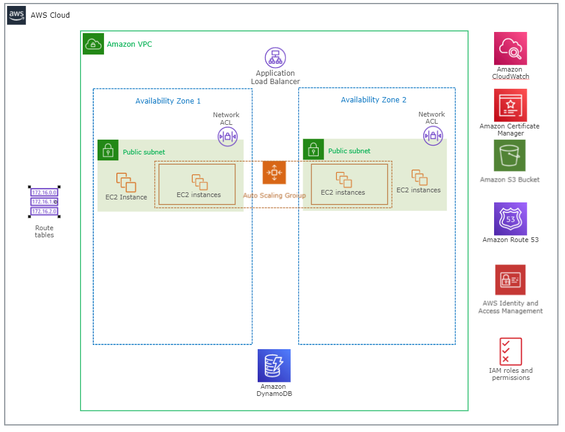

# Employee Directory Application Infrastructure on AWS

The employee directory application is  being hosted across multiple EC2 instances inside of a VPC.The EC2 instances are part of an EC2 auto scaling group and traffic is being distributed across them using an Application Load Balancer.
The database is being hosted on Amazon DynamoDB and the images are stored in S3. Amazon Route53 service was used for DNS operations. SSL certificate was generated from Amazon ACM and secure connection was established. Metrics and alarms were created via Amazon CloudWatch.

